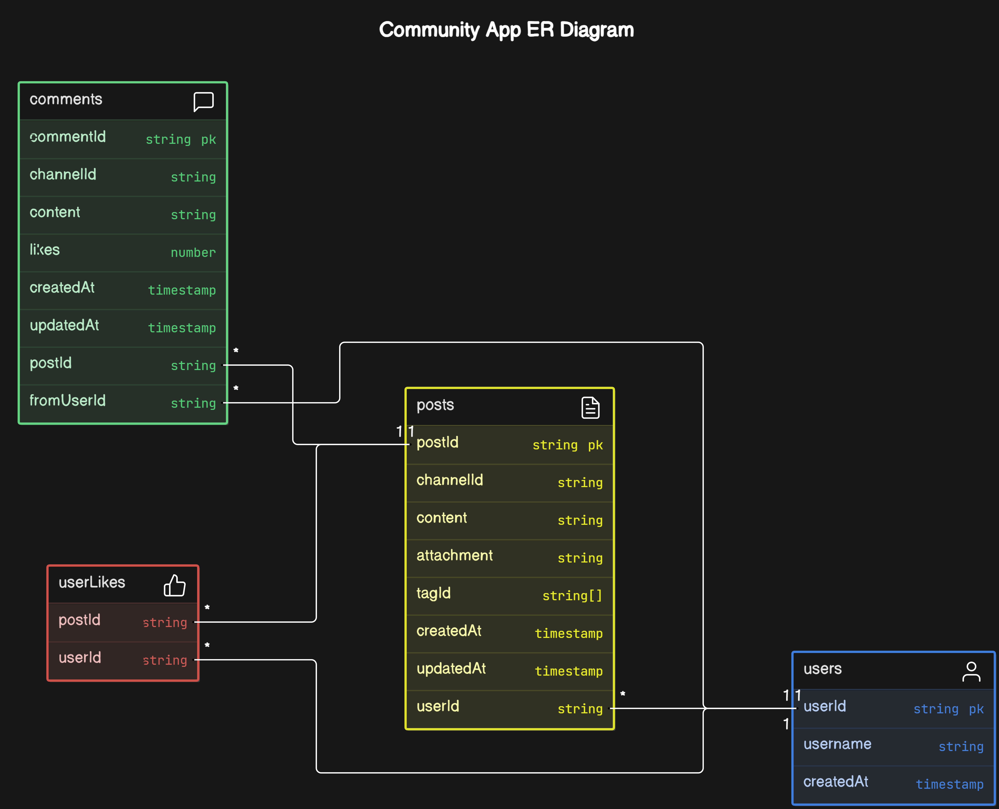

## Community App

A Community App where users can post content, receive real-time updates, react to posts, and comment on each other's posts.
- Live link [here](https://community-app.pages.dev/)

#### Check the end of page to get started locally

## Features

- **User Authentication**: Users can log in and log out of the application.
- **Post Viewing**: Users can view posts from other users.
- **Post Creation**: Users can create new posts.
- **Comments**: Users can comment on posts.
- **Likes/Unlikes**: Users can like or unlike posts.
- **Bookmarks**: Users can bookmark posts for later viewing.
- **Search and Filter**: Users can search for posts and filter them based on categories or tags.
- **Real-time Notifications**: Users receive live notifications for interactions such as likes and comments.

## Additional Features

- **Live Notification Count**: Updates the notification count in real-time as new posts are made across various channels and notifies users, implemented via short polling due to compatibility issues with websockets and the Hono framework on Cloudflare Workers.
- **Scroll Progress Bar**: Displays a progress bar to indicate the percentage of posts viewed as the user scrolls through the page.
- **Performance Improvements**: Includes client-side caching through RTK Query and Redux to ensure efficient page renders only upon receiving new data, supplemented by database-level indexing for rapid query execution.
- **Responsive Design**: Fully responsive design ensures a seamless user experience across all device sizes.
- **Collapsing Sidebar**: Features a collapsible sidebar for quick navigation between different sections of the application, optimizing space on smaller screens.
- **Instant Feedback**: Instant feedback available wether an operation was successful or not with the help of react hot toast library
- **Caching**: Implemented Prisma Accelerate for efficient connection pooling and optimized query performance by utilizing TTL (Time To Live) and SWR (Stale While Revalidate) caching strategies. This approach significantly improves data retrieval times and reduces database load, ensuring a faster and more scalable application.

## Technology Stack

This project leverages the following technologies:

- **Frontend**:
  - **React**: Utilized for building dynamic user interfaces.
  - **Next.js**: A React framework that enables server-side rendering and static site generation.
  - **Redux**: Employed for state management across the application.
  - **Tailwind CSS, Radix UI, and Framer Motion**: Used for styling and animations to enhance the visual appeal and interactivity.

- **Backend**:
  - **Hono**: A high-performance, lightweight framework designed to operate on Cloudflare Workers.
  - **Cloudflare Workers**: A serverless application platform that ensures auto-scaling and a globally distributed network for minimal latency.

- **Database**:
  - **Neon.tech PostgreSQL**: Serves as the primary data storage solution, offering a serverless architecture that scales automatically, simplifies management, and supports real-time branching to enhance development workflows.

- **Hosting**:
  - **Cloudflare Pages**: Provides hosting for the frontend, ensuring fast loading times and global distribution.
  - **Cloudflare Workers**: Hosts the backend, delivering an auto-scaling solution with widespread availability.

This architecture not only underscores a highly scalable and low-latency web application but also emphasizes reliability and global accessibility, making it suitable for a wide range of users and scenarios.

Database Schema of the application-



Check out the live version of the Community App [here](https://community-app.pages.dev/) to explore all its features. 


## Getting Started Locally

This guide will walk you through setting up the NxtJob Community App locally on your machine for development and testing purposes.

### Prerequisites

- **Node.js**: Ensure you have Node.js installed on your machine. [Download Node.js](https://nodejs.org/en/download/)

### Clone the Repository

Start by cloning the repository to your local machine:

```bash
git clone https://github.com/aneesazc/NxtJob-Community-App.git
cd NxtJob-Community-App
```

## Backend 
1. Install Dependencies:
- Navigate to the backend directory and install the necessary npm packages:
```bash
cd backend
npm install
```
2. Environment Configuration:
- Create a .env file in the backend directory.
- Obtain a database URL instance from a service provider like Neon or Aiven.
- Add the database URL to your .env file:
```bash
DATABASE_URL="your_database_url_instance"
```

3. Prisma Accelerate Setup:
- Create a `wrangler.toml` file in the root of the backend directory.
- Visit Prisma Data Platform Accelerate to get an Accelerate URL.
- Add the Accelerate URL to your `wrangler.toml`:
```bash
[vars]
DATABASE_URL="your_accelerate_url"
```

4. Start the Backend:
```bash
npm run dev
```

## Frontend
1. Install Dependencies:
- Navigate to the `frontend` directory:
```bash
cd ../frontend  # Assuming you're in the backend directory
npm install
```

2. Configure BACKEND URL:
- Go to config.ts file at the root of the frontend folder and replace `https://backend.anees-azc.workers.dev` with `http://127.0.0.1:8787/` and you should be fine.
3. Run the Frontend:
```bash
npm run dev
```
- This will start your frontend application at localhost:3000 

## Next Steps
- Open your web browser and navigate to `http://localhost:3000` to view the application.
- Begin developing or testing your changes to the application.


